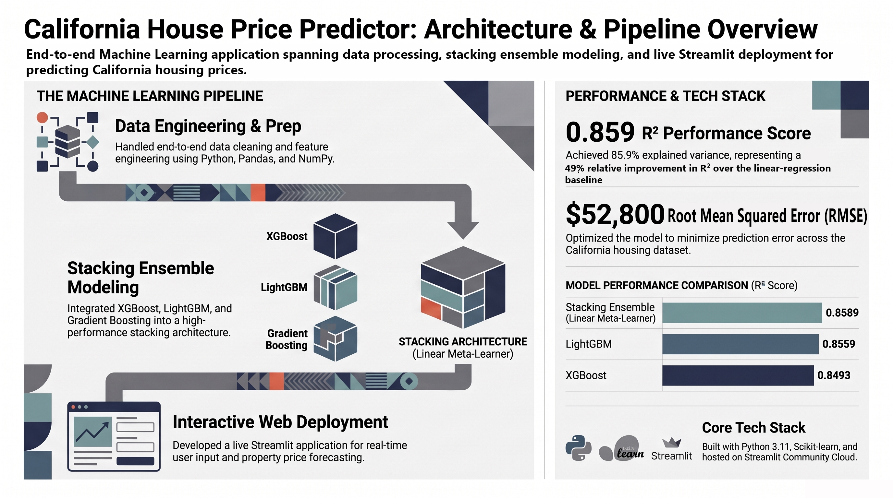
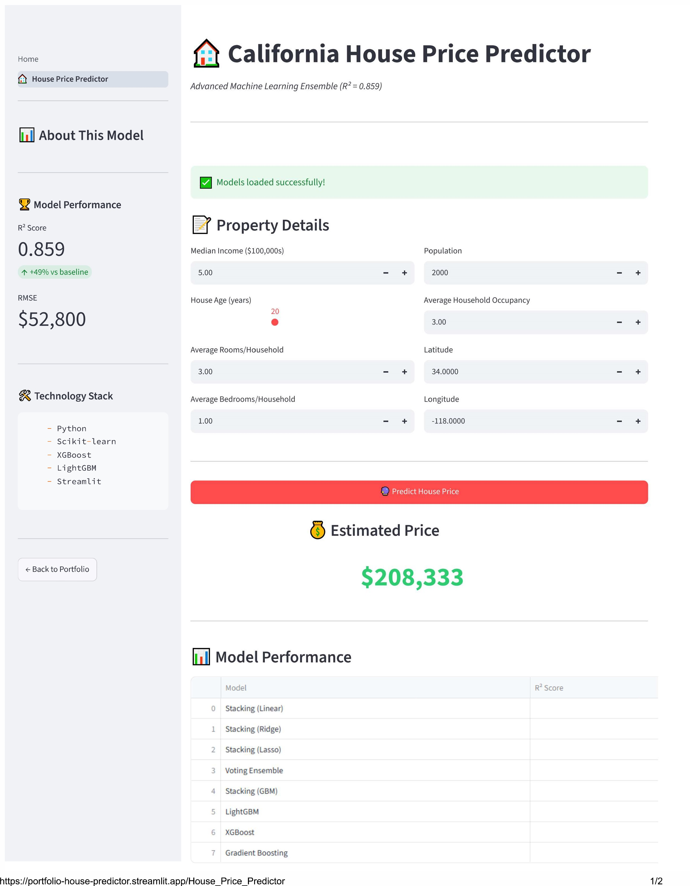

# 🏠 California House Price Predictor

An end-to-end machine-learning application for estimating California housing prices using a stacked ensemble model and an interactive Streamlit interface.

The project covers the full workflow from data preparation and model comparison to ensemble learning, evaluation, saved-model inference, and web deployment.

[](https://portfolio-house-predictor.streamlit.app)
[](https://www.python.org/)
[](LICENSE)

---

## 📊 Live Demo

Try the deployed application:

**https://portfolio-house-predictor.streamlit.app**

Users can adjust property characteristics and receive a real-time predicted house price from the trained ensemble model.

---

## 🖼️ Project Overview




The pipeline covers:

`Data preparation → Model training → Model comparison → Stacking ensemble → Evaluation → Streamlit deployment`

---

## 🎯 Project Goal

The goal of this project is to build a complete regression workflow rather than only train a prediction model.

The project explores how multiple regression algorithms perform on the California housing dataset and combines the strongest models through stacking to improve predictive performance.

The final trained model is then exposed through a Streamlit application so users can interact with the model directly.

---

## 🧠 Model Architecture

The final prediction system uses a stacking ensemble that combines:

- XGBoost
- LightGBM
- Gradient Boosting

A linear meta-learner combines the predictions of the base models to produce the final estimate.

This approach allows the ensemble to benefit from different model behaviors instead of relying on a single regression algorithm.

---

## 📈 Key Results

| Metric | Result |
|---|---:|
| R² Score | **0.859** |
| Explained variance | **85.9%** |
| RMSE | **$52,800** |
| Relative R² improvement over linear-regression baseline | **49%** |

The stacking ensemble achieved the strongest overall R² performance among the evaluated models.

### Selected Model Comparison

| Model | R² Score |
|---|---:|
| Stacking Ensemble | **0.8589** |
| LightGBM | 0.8559 |
| XGBoost | 0.8493 |

> The reported results correspond to the evaluation configuration used in this project and should not be interpreted as universal performance guarantees.

---

## 🖥️ Application Preview



The Streamlit interface allows users to enter housing characteristics such as:

- median income
- house age
- average rooms per household
- average bedrooms per household
- population
- average household occupancy
- latitude
- longitude

The trained model then generates an estimated property value in real time.

---

## 🚀 Features

- End-to-end regression workflow
- Data cleaning and feature preparation
- Comparison of multiple regression models
- Gradient-boosting models
- Stacking ensemble architecture
- Saved-model inference
- Interactive property inputs
- Real-time price prediction
- Model-performance display
- Streamlit deployment

---

## 🛠️ Tech Stack

### Machine Learning

- Scikit-learn
- XGBoost
- LightGBM
- Gradient Boosting

### Data Processing

- Python 3.11
- pandas
- NumPy

### Application

- Streamlit

### Development

- Git
- GitHub
- Python virtual environments

---

## 📁 Project Structure

```text
House_Price_Predictor/
├── Home.py
├── pages/
│   └── ...
├── Projects/
│   └── house_price_prediction/
│       ├── training and experimentation code
│       └── saved model artifacts
├── requirements.txt
├── LICENSE
└── README.md

---

## 🔄 Workflow

California Housing Data
        ↓
Data Cleaning & Preparation
        ↓
Model Training
        ↓
Model Comparison
        ↓
Stacking Ensemble
        ↓
Model Evaluation
        ↓
Saved Model
        ↓
Streamlit Application
        ↓
Real-Time Prediction

---

## 📄 License


This version is much closer to the level of the project itself.

One thing I particularly recommend keeping is the **Limitations** section. It makes the project look more professional, not weaker. It shows that you understand what an R² of 0.859 and an RMSE of $52,800 actually mean and that you are not presenting an ML demo as a real estate valuation system.

Also, your new architecture graphic and application screenshot now have a clear purpose instead of just being decorative:

**architecture visual → engineering evidence**  
**application screenshot → deployment evidence**

So yes, I would revise the text before calling the House Price repository finished.
